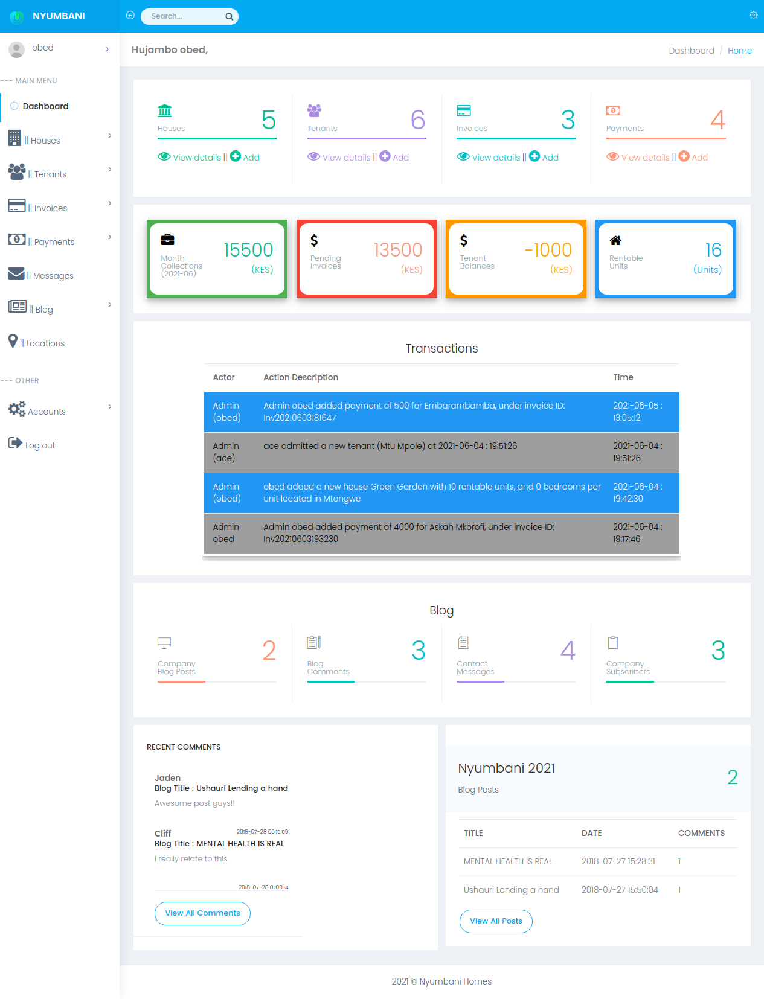
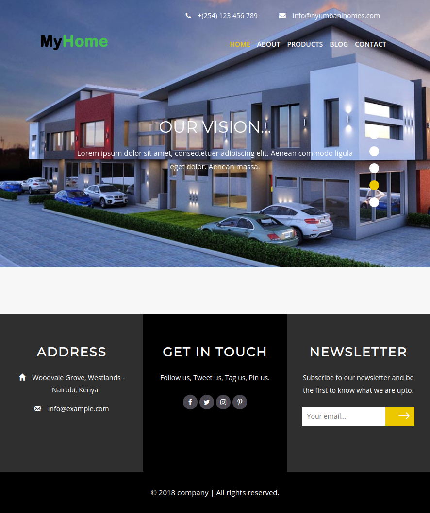
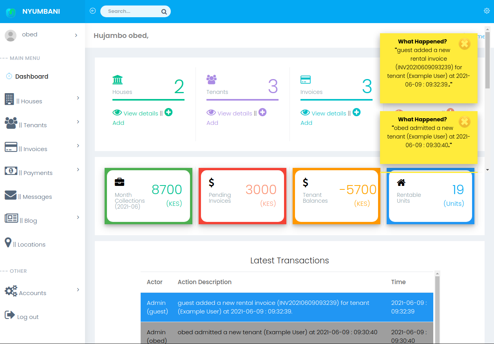
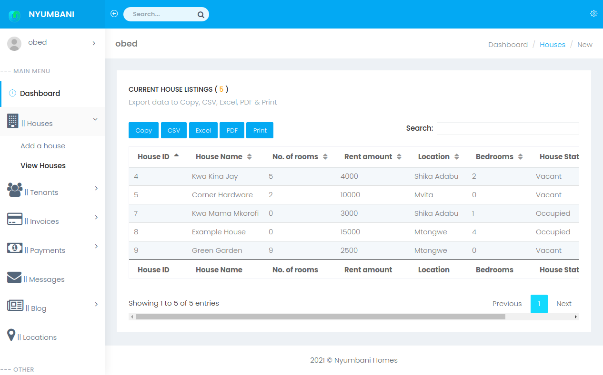
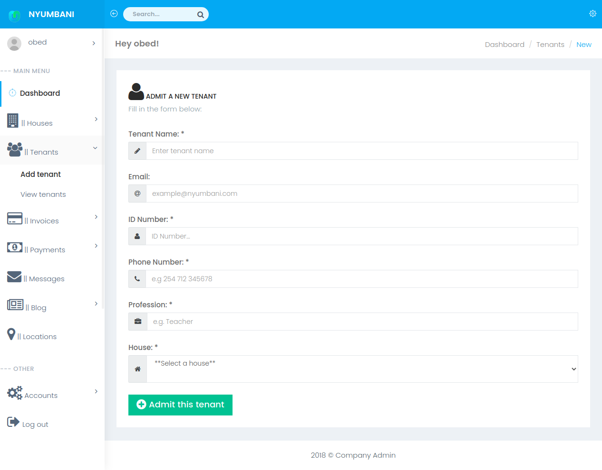
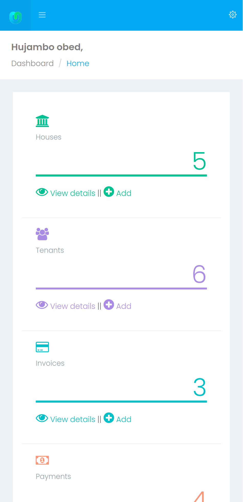
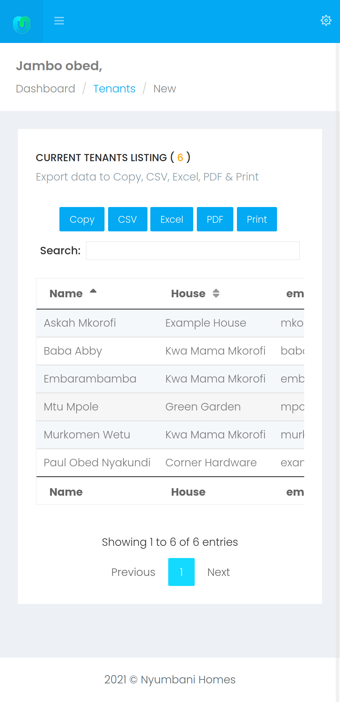
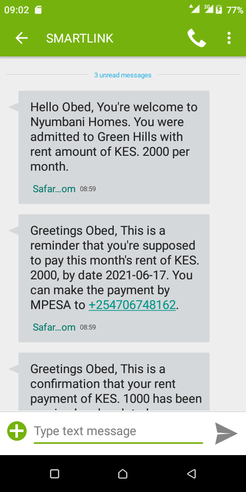
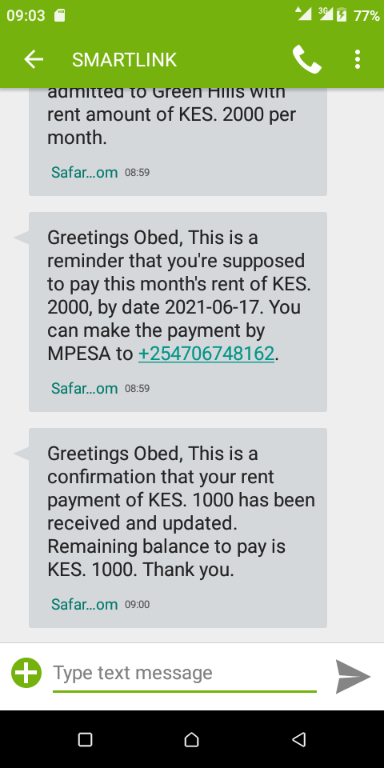

# A web-based Rental House Management System
This is a web application for Rental House Management (with SMS, and Mpesa integration). 

## Included features
- a fancy landing page for display of vacant rooms/houses
- an administrator panel 
- a blog 
- a database

## Major Dependencies
- PHP 8.1+ with the `mysqli`, `pdo_mysql` and `curl` extensions
- MySQL / MariaDB
- Bootstrap, jQuery, Morris.js and Font Awesome (vendored under `plugins/` and `admin/`)
- [MoveSMS](https://movesms.co.ke) for tenant SMS notifications (optional)

# THE USER'S GUIDE
## HOW TO INSTALL:
 - Install XAMPP/WAMP (or any PHP 8.1+ host with MySQL)
 - Create a database named `Company`
 - Import `database/Company.sql` into it
 - Copy all the contents of the folder containing `index.php` to your server
 - Copy `admin/functions/config.example.php` to `admin/functions/config.php` and fill in your
   database connection, M-Pesa number and (optionally) MoveSMS credentials.
   `config.php` is git-ignored, so your credentials stay out of the repository.
   Every value can also be set through environment variables (`DB_HOST`, `DB_USER`,
   `DB_PASSWORD`, `DB_NAME`, `MPESA_NUMBER`, `MOVESMS_USERNAME`, `MOVESMS_API_KEY`, ...).
 - Open `index.php` for the public site
 - Open the `admin/` folder to log in to the admin panel

## TO TEST:
Admin panel login credentials are:
 - USER NAME:  **obed@example.com**
 - PASSWORD:   **mimi**

## YouTube Link:
Watch the System **[illustration video](https://www.youtube.com/watch?v=uL3LVG_FmCc&t=1095s)** here: [https://www.youtube.com/watch?v=uL3LVG_FmCc&t=1095s](https://www.youtube.com/watch?v=uL3LVG_FmCc&t=1095s)

## Live Testing
Try it Live **[Here:](https://www.basedatasoftwares.co.ke/rentals/admin)** (https://www.basedatasoftwares.co.ke/rentals/admin) Courtesy of **[BaseData Softwares](https://www.basedatasoftwares.co.ke)**

# License
This is the original app as was developed in 2018. A few changes have been made ever since its deployment to enhance its security, stability, and efficiency. Even then, we took care to retain the stability of this application. It's my hope that you will find this app fun to use and easy to improve. 

Feel free to use it as it will suit you. To receive a complete version of the software, please reach out to me via:

# Need further support?
Reach out for a stable version or support via:
Email: *paulnyaxx@gmail.com* or 
Tel:   *+254700000000*

# By me some coffee
You can offer support via 
1. M-Pesa:  **+254700000000** or 
2. Paypal: **harrysp254@gmail.com**

I wish you all the best as you explore this limited app!

# Views
## The Blog

## Admin Dashboard with notifications

## Table Sample (House Listing)

## Form Sample (Form for admitting a tenant)

# Mobile phone views
## Phone dashboard

## Phone form (admitting a tenant)

## Phone SMS notifications

# Credits
Based on [ObedNyakundi/Rental-house-management-system](https://github.com/ObedNyakundi/Rental-house-management-system).

# Special Thanks to:
- [Obed Nyakundi](https://github.com/ObedNyakundi)
- [Basedata Softwares](https://www.basedatasoftwares.co.ke)